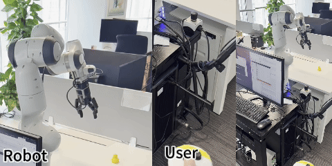

# Real-Robo Teleoperation (RR-T)

Welcome to Real-Robo, an integrated framework for robotic teleoperation and control, designed to streamline the collection of tele-operation data.



We invite and appreciate all contributions, whether it's reporting an issue, submitting a pull request, or offering feedback. Your input is crucial to us. Join our community to help enhance and simplify the data collection process!

## Setup

- Please refer to [Setup](./docs/setup.md) for more details.
- Please refer to [Usage](./docs/usage.md) for more details.
- Please refer to [Data Collection](./docs/data_collection.md) for more details.
- For camera calibration, please see the [Camera Calibration Guide](https://github.com/real-dex-suite/REAL-ROBO/blob/main/tools/calibration/CAMERA_CALI.md). You may need to calibrate the camera if you plan to use point cloud data.

## TODO

- [ ] Add more devices
- [ ] Add better documentation
- [ ] Add more examples
- [ ] Add more tutorials

## Acknowledgement

Real-Robo mainly borrows [Holo-dex](https://github.com/SridharPandian/Holo-Dex) framework. For the dexterous hand retargeting, we refer to and modify [AnyTeleop](https://github.com/dexsuite/dex-retargeting). Please cite their work if you use this code in your research. Thanks for their wonderful job!

Maintained by:

- Jinzhou Li ([kingchou007](https://github.com/kingchou007))
- Hongwei Fan ([hwfan](https://github.com/hwfan))
- Tianhao Wu ([tianhaowu](https://github.com/tianhaowuhz))
- Jiyao Zhang ([jiyao06](https://github.com/Jiyao06))

We thank them for their contributions.

## Citation

If you find this code useful, please cite our paper:

```bibtex
@article{li2025adaptive,
  title={Adaptive Visuo-Tactile Fusion with Predictive Force Attention for Dexterous Manipulation},
  author={Li, Jinzhou and Wu, Tianhao and Zhang, Jiyao and Chen, Zeyuan and Jin, Haotian and Wu, Mingdong and Shen, Yujun and Yang, Yaodong and Dong, Hao},
  journal={arXiv preprint arXiv:2505.13982},
  year={2025}
}
```
