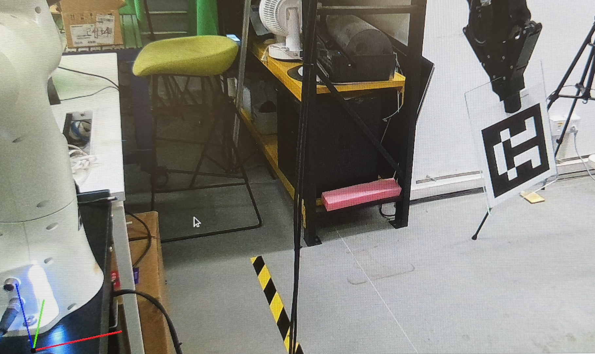

rr# Camera-Robot Calibration Guide

## Environment Setup
Don't forget to source the ROS environment before running the following commands
```bash
source /opt/ros/noetic/setup.bash
```

### Installation Steps
- [ ] install calibration in this framework
- [ ] auto save and re-calibrate the calibration result
- [ ] add an automation script to run the calibration
- [ ] Eye in hand calibration


### Eye-to-Hand Calibration Instructions

This guide explains how to run the eye-to-hand calibration between a camera and robot arm using `cali_eye2hand.py`.

#### Prerequisites
Make sure you have:

- A RealSense camera mounted in a fixed position observing the robot workspace

- A Franka robot arm can read tcp pose

- An ArUco marker (ID: 582) attached to the robot end-effector

- ROS Noetic environment set up

### Start the environment
note: please source the ROS environment before running the following commands
1. Open a new terminal and launch the RealSense camera node:
```bash
source /opt/ros/noetic/setup.bash
roslaunch realsense2_camera rs_camera.launch
```
2. Open a new terminal and launch the rqt_image_view:
```bash
source /opt/ros/noetic/setup.bash
rqt_image_view
```
We already have a script to launch the camera node and rqt_image_view, you can run the following command to launch them:
```bash
bash tools/calibration/run_calibrate.sh
```

3. Start Franka
```bash
conda activate real-robo
bash pipelines/start_franka.sh
```
And Press the
Note: Test franka api use tcp_test.py
```bash
bash pipelines/franka_init.sh
python tools/calibration/tcp_test.py
```
Make sure the tcp chaging while you move the robot.


### Calibration 
3. Run the calibration script:
```bash
bash pipelines/franka_init.sh
python cali_eye2hand.py
```

Now, you can see the aurco marker in the rqt_image_view. Press any key to continue, press q to quit.

Usually, we need to calibrate more than 20 views to get a good calibration result.

- some suggestion: 1. dont move too much far away
- more rotation

### Calibration Result

The calibration result is saved in the `calibration_results` folder.

The result is a `npy` file, you can load it in the `cali_eye2hand.py` script to get the camera-robot transformation matrix.

#### Calibration Result Visualization

You can test the calibration result by running the following command:
```bash
# test the calibration result with 20 views
python tools/calibration/cali_eye2hand.py -t 20
```
Please refer to the visualization example below:


I am randomly moving the robot arm, and the coordinate axes almost aligned with the robot arm. The example is not the best case, you can try to move the robot arm to different positions to get a better result. The expected result is that the coordinate axes are aligned with the robot arm base well.


### Dependencies
1. Install ROS Noetic (if not already installed):
```bash
sudo apt-get install ros-noetic-sensor-msgs ros-noetic-cv-bridge ros-noetic-realsense2-camera
```

2. Install OpenCV:
```bash
sudo apt-get install python3-opencv click
```


